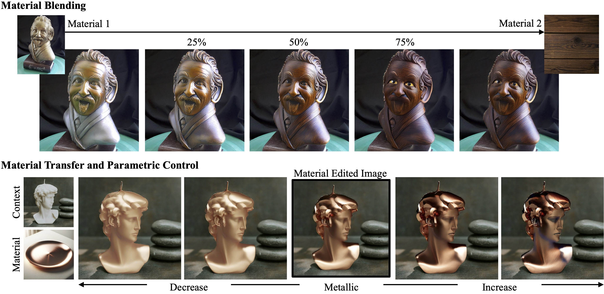

#  MARBLE

<a href='https://marblecontrol.github.io'></a> 
<a href='https://marblecontrol.github.io/static/MARBLE.pdf'></a> 
<a href='https://github.com/Stability-AI/marble'></a>

This is the official implementation of MARBLE: Material Recomposition and Blending in CLIP-Space. Given an input image, MARBLE enables edits from material transfer, blending, to parametric control.




## Installation
MARBLE material blocks are built from the code base of [InstantStyle](https://github.com/instantX-research/InstantStyle). Additional functions are added into the `ip_adapter_instantstyle/ip_adapter.py` but please cite their papers accordingly.

The current code base is tested on Python 3.9.7.

We will begin by cloning this repo:

```
git clone https://github.com/Stability-AI/marble.git
```

Then, install the latest the libraries with:

```
cd marble
pip install -r requirements.txt
```

## Usage

After installation and downloading the models, you can use the two demos `try_blend.ipynb` for material blending and `parametric_control.ipynb` for material transfer + multi-attribute parametric control.

We also provide a gradio demo which can be run with `python gradio_demo.py`.


### Using your own materials
For material transfer, you could add your images `input_images/texture/`.


### ComfyUI extension

Custom nodes and an [example workflow](./example_workflow.json) are provided for [ComfyUI](https://github.com/comfyanonymous/ComfyUI).

To install:

* Clone this repo into ```custom_nodes```:
 ```shell
  $ cd ComfyUI/custom_nodes
  $ git clone https://github.com/Stability-AI/marble
 ```
* Install dependencies:
 ```shell
  $ cd marble
  $ pip install -r requirements.txt
 ```
* Restart ComfyUI


## Citation
If you find MARBLE helpful in your research/applications, please cite using this BibTeX:

```bibtex
@article{cheng2024marble,
  title={MARBLE: Material Recomposition and Blending in CLIP-Space},
  author={Cheng, Ta-Ying and Sharma, Prafull and Boss, Mark and Jampani, Varun},
  journal={CVPR},
  year={2025}
}
```
